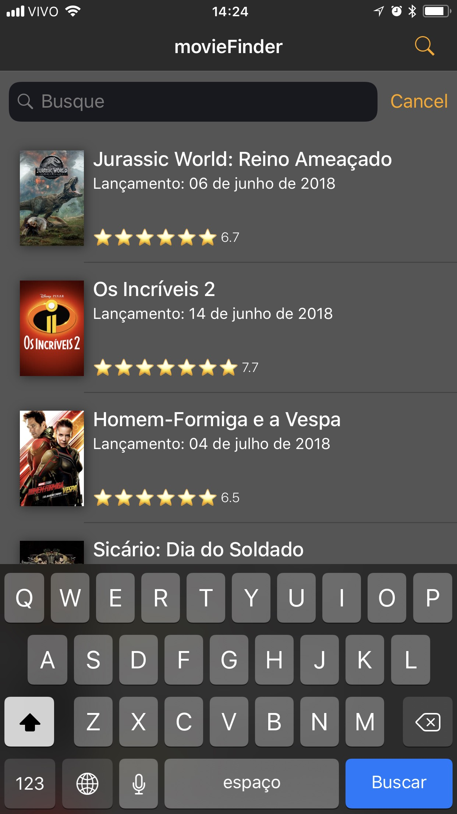

# movieFinder 
[](https://app.bitrise.io/app/347fd33967e0c840)
[](https://codecov.io/gh/narlei/movieFinder)
[](https://twitter.com/narleimoreira)

An upcoming movie list to help you to discover movies.

|   |   |   |
|---|---|---|
||||


## Instalation

This project uses [Cocoapods](http://cocoapods.org).

Clone the project and Run:

`pod install`

## Design

See the prototype [here](https://bit.ly/2KILXyn)

Sketch project is inside `design` folder.


## Libraries

- [SDWebImage](https://github.com/rs/SDWebImage)
- [Moya](https://github.com/Moya/Moya)
- [UIScrollView-InfiniteScroll](https://github.com/pronebird/UIScrollView-InfiniteScroll)
- [R.swift](https://github.com/mac-cain13/R.swift)

## Features

- List movies from [TMDB](http://themoviedb.org/)
- Show movies details
- Cache movies offline
- Peek&Pop to preview
- Icon shortcut to Search
- This app supports English, Spanish and Portuguese

## To Do

- [ ] More details (Improve details layout)
- [x] Improve Code Coverage 
- [x] Internacionalization

## Internacionalization

This project uses [lokalise.co](https://lokalise.co) Software to manage localizable files.

**What?**

1. Upload localization files
We support all popular iOS, Android and web localization file formats.

2. Translate
Invite your team to work on translations, or use professional translation services provided by our partners.

3. Integrate
Use Lokalise iOS and Android SDK, API, CLI tool and other integration options, or simply download the files.

### Library [R.swift](https://github.com/mac-cain13/R.swift)

Easy to use plurals and all internationalization attributes.

*How it works?*


````swift
print(R.string.localizable.yesterday()) // Ontem
````


````swift
print(R.string.localizable.days_ago(format: date.daysAgo)) // 5 dias atrás
````

````swift
print(R.string.localizable.like_activity_title(format: activityPost.arrayLikes.count)) // Curtida / Curtidas
````

